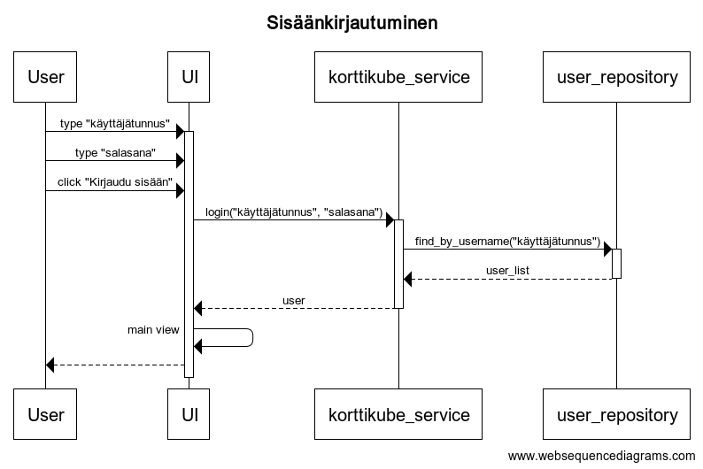
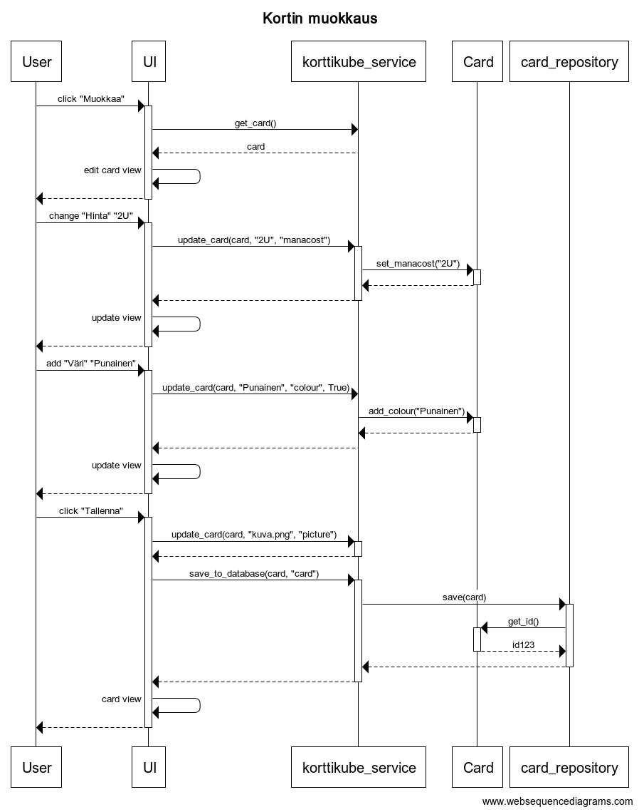

# Arkkitehtuurikuvaus

## Rakenne

Ohjelman rakenne noudattaa kerrosarkkitehtuuria, jossa ylempänä oleva kerros käyttää ainoastaan alempana olevien kerroksien tarjoamia palveluita. Ylimpänä kerroksista on käyttöliittymäkerros, jonka alapuolella on sovelluslogiikka. Alimpana on tallennuspalvelut ja oliot. Koodin pakkausrakenne on havainnollistettu seuraavassa kuvassa:

## Käyttöliittymä
Käyttöliittymä koostuu neljästä päänäkymästä ja niiden alanäkymistä:
* Kirjautumissivu [LoginView](https://github.com/Noissi/ot_harjoitustyo/edit/master/src/ui/login_view.py)
  * Uuden käyttäjän luonti -sivu [CreateUserView](https://github.com/Noissi/ot_harjoitustyo/edit/master/src/ui/create_user_view.py)
* Etusivu [MainView](https://github.com/Noissi/ot_harjoitustyo/edit/master/src/ui/main_view.py)
* Kubesivu [CubeView](https://github.com/Noissi/ot_harjoitustyo/edit/master/src/ui/cube_view.py)
* Korttisivu [CardView](https://github.com/Noissi/ot_harjoitustyo/edit/master/src/ui/card_view.py)
  * Kortinmuokkaussivu [EditCardView](https://github.com/Noissi/ot_harjoitustyo/edit/master/src/ui/edit_card_view.py)

Näkymien näyttämsestä vastaa [UI](https://github.com/Noissi/ot_harjoitustyo/edit/master/src/ui/ui.py)-luokka. Jokainen näkymä on toteutettu omana luokkanaan, joista osa perii [Window](https://github.com/Noissi/ot_harjoitustyo/edit/master/src/ui/window.py)-näkymäpohjan. Lisäksi kortin visualisoinnille on olemassa oma _QWidget_ [CardImage](https://github.com/Noissi/ot_harjoitustyo/edit/master/src/ui/card_image.py)-luokkansa, joka lisätään kortin muokkaamisen aikana näytettävään [EditCardView](https://github.com/Noissi/ot_harjoitustyo/edit/master/src/ui/edit_card_view.py)-näkymään. Käyttöliittymä kutsuu [KorttikubeServicen](https://github.com/Noissi/ot_harjoitustyo/edit/master/src/services/korttikube_service.py) metodeita.

## Sovelluslogiikka

Loogisen tietomallin mudostavat kolme olioluokkaa: [User](https://github.com/Noissi/ot_harjoitustyo/edit/master/src/entities/user.py), [Cube](https://github.com/Noissi/ot_harjoitustyo/edit/master/src/entities/cube.py) ja [Card](https://github.com/Noissi/ot_harjoitustyo/edit/master/src/entities/card.py). Luokat kuvaavat yksittäistä käyttäjää, kubea ja korttia luokkakaaviossa esitetyllä tavalla:

Toiminnallisesta kokonaisuudesta vastaa luokka [KorttikubeService](https://github.com/Noissi/ot_harjoitustyo/edit/master/src/services/korttikube_service.py). Luokka pitää kirjaa ohjelman nykytilanteesta eli käyttäjästä ja tarkastelun alla olevasta kubesta ja kortista. Käyttäliittymä käyttää näitä attribuutteja sekä luokan tarjoamia metodeita toiminnoissaan. [KorttikubeServicellä](https://github.com/Noissi/ot_harjoitustyo/edit/master/src/services/korttikube_service.py) on tieto myös käytettävistä repositorioista ([UserRepository](https://github.com/Noissi/ot_harjoitustyo/edit/master/src/repositories/user_repository.py), [CubeRepository](https://github.com/Noissi/ot_harjoitustyo/edit/master/src/repositories/cube_repository.py), [CardRepository](https://github.com/Noissi/ot_harjoitustyo/edit/master/src/repositories/card_repository.py)), joiden avulla se saa luettua käyttäjien, kubejen ja korttien tiedot tietokannasta.

Ohjelman osien suhdetta kuvaa seuraava pakkauskaavio:

## Tiestojen tallennus

Tiestojen tallentamisesta huolehtivat repositorioluokat [UserRepository](https://github.com/Noissi/ot_harjoitustyo/edit/master/src/repositories/user_repository.py), [CubeRepository](https://github.com/Noissi/ot_harjoitustyo/edit/master/src/repositories/cube_repository.py) ja [CardRepository](https://github.com/Noissi/ot_harjoitustyo/edit/master/src/repositories/card_repository.py, jotka tallettavat tiedon SQLite-tietokantaan. Initialise_database-funktio alustaa tietokannan ja luo sille database.db-tiedoston.

Lisäksi ohjelma luo png-kuvia korteista, jotka se tallettaa _imgcards_-tiedostoon. Halutessaan käyttäjä voi myös ladata korttitiedot csv-tiedostoon, joka talletetaan _userfiles_-kansioon.

## Päätoiminnallisuudet

Sekvenssikaavioita sovelluksen muutamasta päätoiminnallisuudesta.

### Sisäänkirjautuminen

Sisäänkirjautuessa käyttäjä syöttää käyttäjätunnuksensa ja salasanansa niille annettuihin kenttiin ja painaa _Kirjaudu sisään_-nappia. Sovelluksen kontrolli käy läpi tällöin seuraavat vaiheet:

Korttikube_service tarkastaa onko kyseistä käyttäjätunnusta olemassa sekä tarkistaa onko salasana oikein. Mikäli nämä ehdot pätevät, kirjaa sovellus käyttäjän sisään ja avaa etusivun (main_view).

### Kortin luonti

Uutta korttia luodessa käyttäjä painaa _Uusi kortti_-nappia, joka siirtää hänet kortinmuokkausnäkymään. Sovelluskontrolli käy läpi tällöin seuraavat vaiheet:

Sovellus luo uuden kortti-olion ja asettaa sen käsiteltäväksi kortiksi. Nyt käyttäjä voi muokata korttia antamalla sille esimerkiksi nimen. Kortin nimi tallettuu korttioliolle. Lopulta käyttäjä voi tallentaa kortin painamalla _Tallenna_-nappia. Tällöin kortti tallettuu tietokantaan ja käyttäjä palaa korttinäkymään.

### Kortin muokkaus

Käyttäjä voi muokata korttia painamalla _Muokkaa_-napista. Sovelluskontrolli käy läpi tällöin seuraavat vaiheet:

Ohjelma tarkistaa ensin, onko käsiteltävää korttia vielä asetettu. Sen jälkeen ohjelma siirtyy kortinmuokkausnäkymään, jossa käyttäjä voi muokata haluamiaan kortin ominaisuuksia. Muokatut ominaisuudet, päivittyvät kortti-olioon, mutta ei vielä käsiteltävään korttiin. Kun käyttäjä lopulta tallettaa muutokset _Tallenna_-napista, kortti tallennetaan tietokantaan ja käsiteltävä kortti päivittyy muokattuun korttiolioon.
