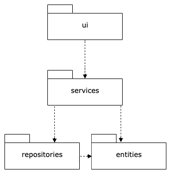
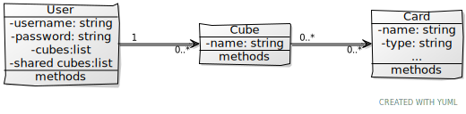
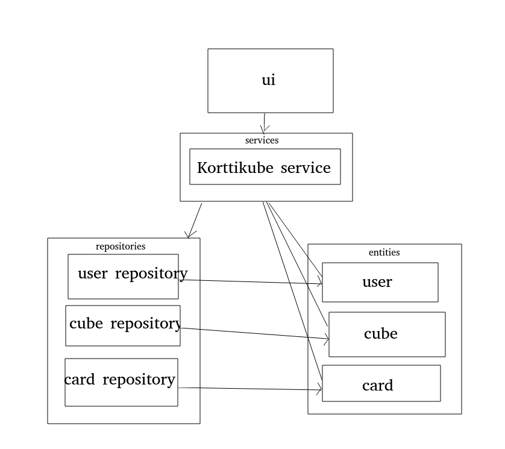
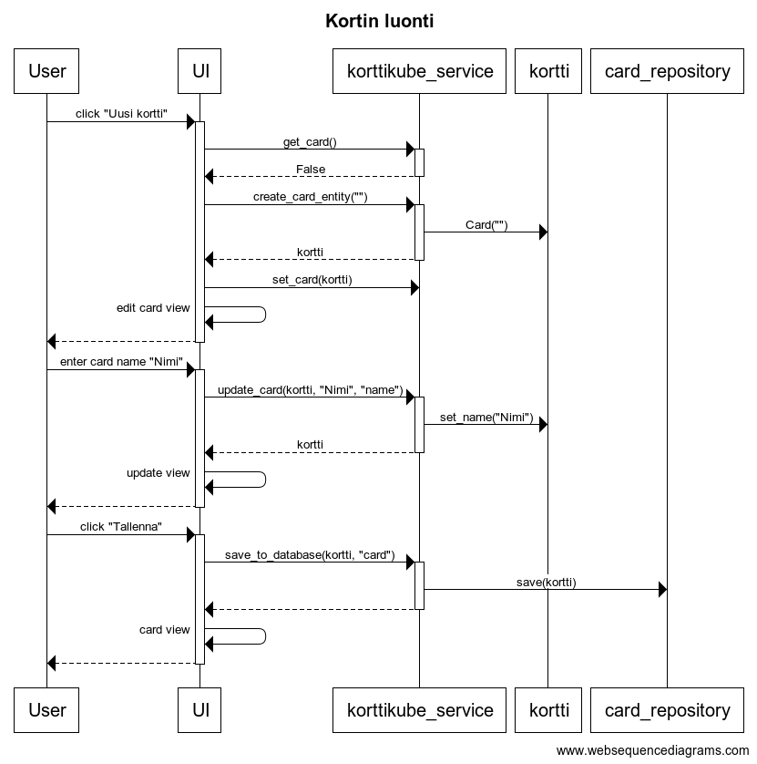

# Arkkitehtuurikuvaus

## Rakenne

Ohjelman rakenne noudattaa kerrosarkkitehtuuria, jossa ylempänä oleva kerros käyttää ainoastaan alempana olevien kerroksien tarjoamia palveluita. Ylimpänä kerroksista on käyttöliittymäkerros, jonka alapuolella on sovelluslogiikka. Alimpana on tallennuspalvelut ja oliot. Koodin pakkausrakenne on havainnollistettu seuraavassa kuvassa:

## Käyttöliittymä
Käyttöliittymä koostuu neljästä päänäkymästä ja niiden alanäkymistä:
* Kirjautumissivu [LoginView](https://github.com/Noissi/ot_harjoitustyo/edit/master/src/ui/login_view.py)
  * Uuden käyttäjän luonti -sivu [CreateUserView](https://github.com/Noissi/ot_harjoitustyo/edit/master/src/ui/create_user_view.py)
* Etusivu [MainView](https://github.com/Noissi/ot_harjoitustyo/edit/master/src/ui/main_view.py)
* Kubesivu [CubeView](https://github.com/Noissi/ot_harjoitustyo/edit/master/src/ui/cube_view.py)
* Korttisivu [CardView](https://github.com/Noissi/ot_harjoitustyo/edit/master/src/ui/card_view.py)
  * Kortinmuokkaussivu [EditCardView](https://github.com/Noissi/ot_harjoitustyo/edit/master/src/ui/edit_card_view.py)

Näkymien näyttämsestä vastaa [UI](https://github.com/Noissi/ot_harjoitustyo/edit/master/src/ui/ui.py)-luokka. Jokainen näkymä on toteutettu omana luokkanaan, joista osa perii [Window](https://github.com/Noissi/ot_harjoitustyo/edit/master/src/ui/window.py)-näkymäpohjan. Lisäksi kortin visualisoinnille on olemassa oma _QWidget_ [CardImage](https://github.com/Noissi/ot_harjoitustyo/edit/master/src/ui/card_image.py)-luokkansa, joka lisätään kortin muokkaamisen aikana näytettävään [EditCardView](https://github.com/Noissi/ot_harjoitustyo/edit/master/src/ui/edit_card_view.py)-näkymään. Käyttöliittymä kutsuu [KorttikubeServicen](https://github.com/Noissi/ot_harjoitustyo/edit/master/src/services/korttikube_service.py) metodeita.

## Sovelluslogiikka

Loogisen tietomallin mudostavat kolme olioluokkaa: [User](https://github.com/Noissi/ot_harjoitustyo/edit/master/src/entities/user.py), [Cube](https://github.com/Noissi/ot_harjoitustyo/edit/master/src/entities/cube.py) ja [Card](https://github.com/Noissi/ot_harjoitustyo/edit/master/src/entities/card.py). Luokat kuvaavat yksittäistä käyttäjää, kubea ja korttia luokkakaaviossa esitetyllä tavalla:

Toiminnallisesta kokonaisuudesta vastaa luokka [KorttikubeService](https://github.com/Noissi/ot_harjoitustyo/edit/master/src/services/korttikube_service.py). Luokka pitää kirjaa ohjelman nykytilanteesta eli käyttäjästä ja tarkastelun alla olevasta kubesta ja kortista. Käyttäliittymä käyttää näitä attribuutteja sekä luokan tarjoamia metodeita toiminnoissaan. [KorttikubeServicellä](https://github.com/Noissi/ot_harjoitustyo/edit/master/src/services/korttikube_service.py) on tieto myös käytettävistä repositorioista ([UserRepository](https://github.com/Noissi/ot_harjoitustyo/edit/master/src/repositories/user_repository.py), [CubeRepository](https://github.com/Noissi/ot_harjoitustyo/edit/master/src/repositories/cube_repository.py), [CardRepository](https://github.com/Noissi/ot_harjoitustyo/edit/master/src/repositories/card_repository.py)), joiden avulla se saa luettua käyttäjien, kubejen ja korttien tiedot tietokannasta.

Ohjelman osien suhdetta kuvaa seuraava pakkauskaavio:

## Päätoiminnallisuudet

### Sisäänkirjautuminen

### Kuben luonti

### Kortin luonti

