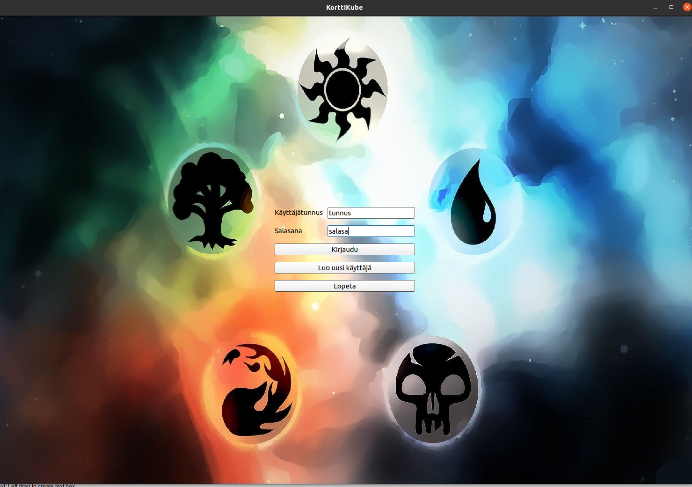
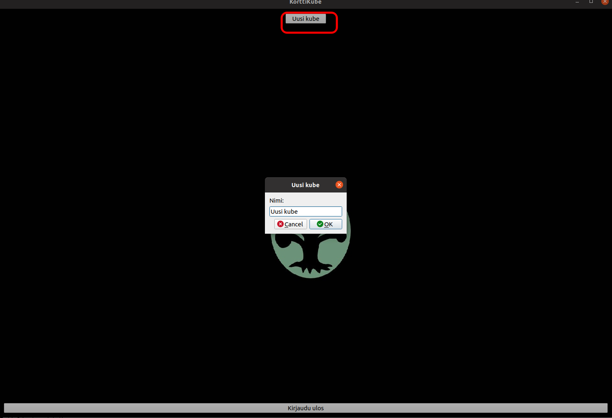
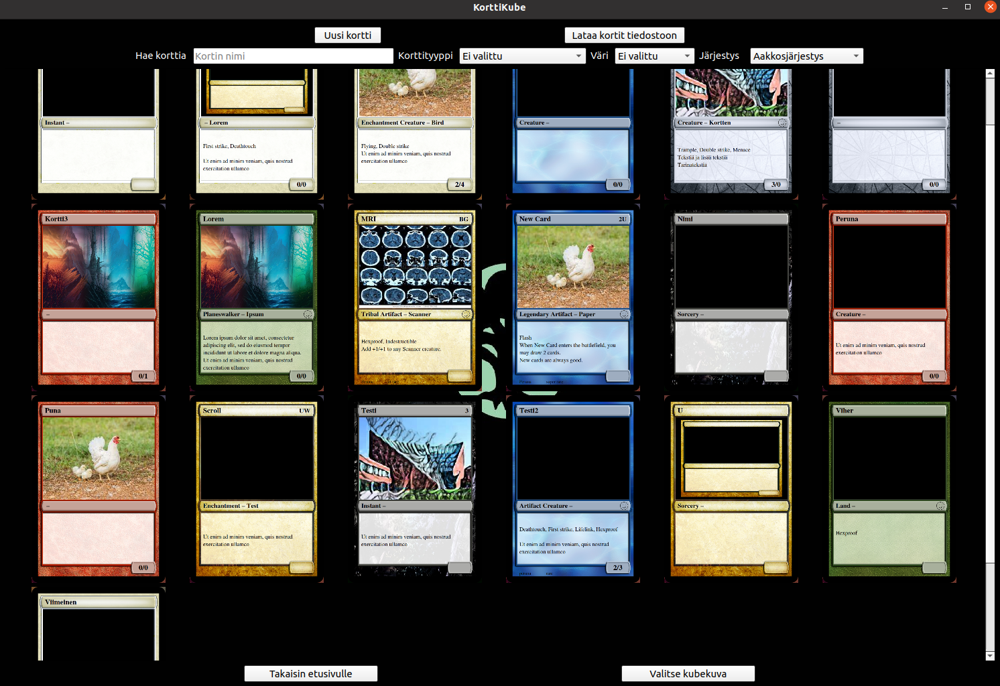

# Käyttöohje

Lataa projektin viimeisin [release](https://github.com/Noissi/ot_harjoitustyo/releases): _Assets_ -> _Source code_.

## Konfigurointi

Tietokantatiedosto _database.db_ luodaan automaattisesti _src_-kansioon ohjelman käynnistyksessä, mikäli tiedostoa ei vielä ole olemassa. Ohjelma myös luo kansiot _imgcards_ ja _imguser_ korttien ja käyttäjän antamille kuville sekä _userfiles_ tiedostoille, jos niitä ei vielä ole. Polkujen ja tiedostonimien muuttaminen onnistuu tiedostossa _config.py_.

## Ohjelman käynnistäminen

Asenna riippuvuudet ennen sovelluksen käynnistämistä komennolla:

```
poetry install
```

Ohjelma käynnistyy komennolla:

```
poetry run invoke start
```

## Käyttö

### Yleistä
Korttikube on kubejen ja korttien luomiseen tehty työkalu. Korttikuben kortit noudattavat ominaisuuksiltaan ja muokattavuudeltaan pääosin MTG:n korttien ominaisuuksia. Korteille voi määritellä vain korttityyppiä vastaavia ominaisuuksia. Esimerkiksi _Land_-korttityyppille ei voi asettaa voimakkuutta (power) eikä kestävyyttä (toughness), sillä ei voi olla heimoa (tribal), sillä ei ole hintaa (cost) ja sille voi asettaa vain kahta eri ominaisuutta (feature). Toisaalta taas _Sorcery_-korttityypillä ei muun muassa ole voimakkuutta ja kestävyyttä paitsi, jos sen alatyyppi on _Vehicle_. Tarkemmin korttien ominaisuuksiin voi perehtyä [MTG:n sivuilla](https://magic.wizards.com/en). Huom. _Plainswalker_ ei monimutkaisuutensa takia piirry oikein, vaan näyttäytyy _Creaturen_ kaltaisena.

### Käyttäjän luonti ja kirjautuminen

Luo aluksi uusi käyttäjä napista _Luo uusi käyttäjä_. Anna valitsemasi käyttäjätunnus ja salasana ja luo käyttäjä.
Kirjaudu sisään tunnuksilla syöttämällä ne tyhjiin kenttiin ja paina _Kirjaudu_-nappia.



### Uuden kuben luonti ja tarkastelu

Luo uusi kube painamalla _Uusi kube_ -nappia ja syöttämällä valitsemasi nimi kubelle. Näkymään ilmestyy nyt uusi kube.
Voit tarkastella haluamaasi kubea painamalla sen kuvaketta, jolloin kubenäkymä avautuu.



### Uuden kortin luominen kubeen

Luo uusi kortti kubeen painamalla _Uusi kortti_ -nappia, jolloin siirryt kortinluontinäkymään.
Anna haluamasi tiedot kortille ja paina _Tallenna_, näet vielä yhteenvedon kortistasi. Pääset takaisin kubenäkymään painamalla _Takaisin_.


### Kortin tarkastelu ja muokkaus
Voit tarkastella haluamaasi kubea painamalla sen kuvaketta, jolloin korttinäkymä avautuu.
Voit muokata kortin tietoja painamalla _Muokkaa_-nappia, jolloin kortinmuokkaussivu avautuu. Kun olet tehnyt haluamais muutokset, voit tallentaa ne _Tallenna_-napista.

### Kubenäkymä ja korttien haku
Kubenäkymässä näet kaikki kuben kortit. Voit hakea kortteja hakukenttien avulla ja järjestää kortit haluamaasi järjestykseen. Voit myös muokata etusivulla näkyvää kubekuvaketta valitsemalla sille kuvan _Valitse kubekuva_-napista.


