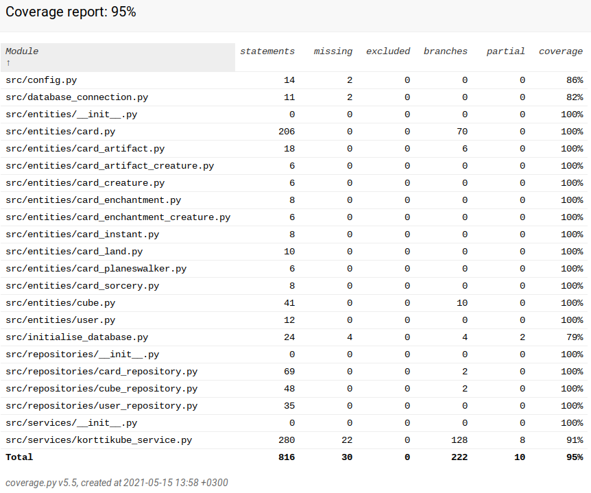

# Testausdokumentaatio

Ohjelmaa on testattu kattavilla yksikkö- ja integraatiotesteillä. Lisäksi ohjelmaa on testattu järjestelmätasolla manuaalisesti.

## Yksikkö- ja integraatiotestaus

### Oliot

Kortti-, Kube-, ja Käyttäjäolioita testataan testiluokilla [TestCard](https://github.com/Noissi/ot_harjoitustyo/blob/master/src/tests/entities/card_test.py), [TestCube](https://github.com/Noissi/ot_harjoitustyo/blob/master/src/tests/entities/cube_test.py) ja [TestUser](https://github.com/Noissi/ot_harjoitustyo/blob/master/src/tests/entities/user_test.py).

### Sovelluslogiikka

Sovelluslogiikkaa testataan [TestKorttikubeService](https://github.com/Noissi/ot_harjoitustyo/blob/master/src/tests/services/korttikube_service_test.py)-testiluokalla, jolle on alustettu FakeCardRepository ja FakeCubeRepository toteuttamaan oikeaa tietokantaa vastaavia toimintoja (tallentamatta tietoa kuitenkaan pysyvään muistiin).

### Repositoriot

Repositorioluokkia (CardRepository, CubeRepository ja UserRepository) testataan erikseen määritellyllä test_database.db-tiedostolla, joka otetaan käyttöön pytest-kutsun yhteydessä (luetaan env.test-tiedostosat). Repositoriotestiluokkia on kolme: [TestCardRepository](https://github.com/Noissi/ot_harjoitustyo/blob/master/src/tests/repositories/card_repository_test.py), [TestCubeRepository](https://github.com/Noissi/ot_harjoitustyo/blob/master/src/tests/repositories/cube_repository_test.py) ja [TestUserRepository](https://github.com/Noissi/ot_harjoitustyo/blob/master/src/tests/repositories/user_repository_test.py).

### Testikattavuus

Sovelluksen haarautumakattavuus on 97% (poislukien käyttöliittymä).

## Järjestelmätestaus

Ohjelmaa on testattu manuaalisesti ongelmien havaitsemiseksi.

Ohjelmaa on testattu usealla eri koneella Linux-pohjaisella käyttöjärjestelmällä.

Konfigurointia on testattu muokkaamalla config.py-tiedostoa. Lisäksi on testattu ohjelman ajamista, kun käynnistettäessä luotavia kansioita ei vielä ole sekä kansioiden jo ollessa.

Ohjelman toiminnallisuuksia on testattu antamalla tekstikenttiin eri syötteitä, valitsemalla eri vaihtoehtoja valikoista sekä siirtymällä näkymästä toiseen.
